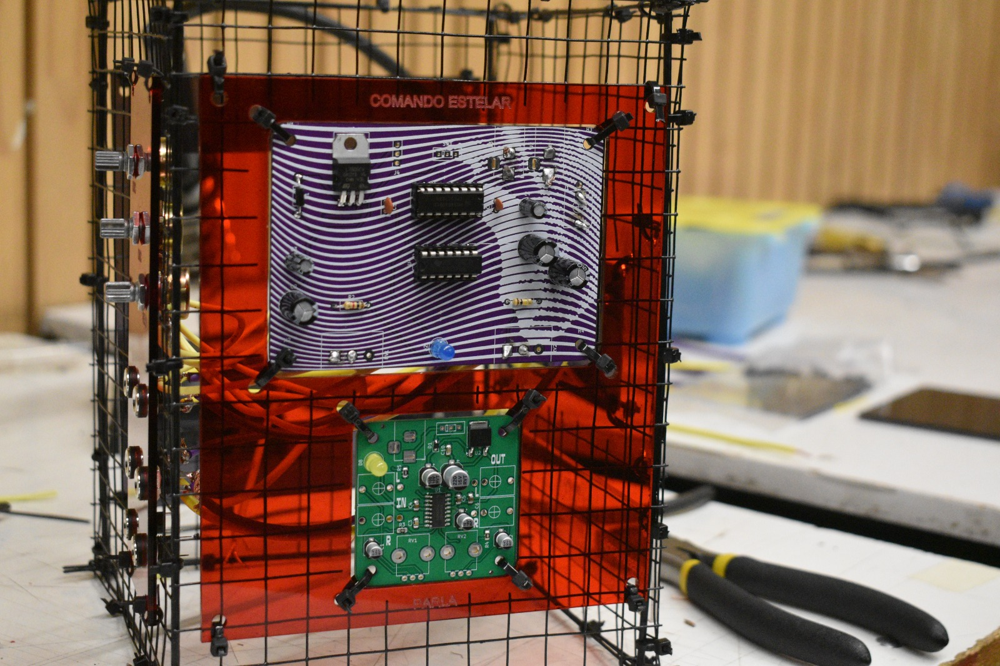

# examen-grupo-03

## integrantes

+ Antonia Loch - [cuenta-github](https://github.com/bla)
+ Narely Riquelme - [cuenta-github](https://github.com/bla)
+ Ariel Orozco - [cuenta-github](https://github.com/bla)
+ Vanessa García - [cuenta-github](https://github.com/bla)
+ Carla Nuñez - [cuenta-github](https://github.com/bla)

# Vitrina Sónica 

Vitrina Sónica es un sintetizador modular construido a partir de la integración de distintos módulos desarrollados de manera colaborativa durante el taller. Cada grupo fue responsable del diseño, fabricación y prueba de una placa específica, en nuestro caso, desarrollamos el módulo oscilador, encargado de generar las señales que constituyen la base sonora del instrumento.

El objetivo del proyecto consistía en comprender la lógica de los sintetizadores modulares, donde cada circuito cumple una función determinada y puede conectarse con otros para crear sistemas sonoros más complejos. A partir de esta metodología, diseñamos un instrumento compuesto por módulos independientes que se comunican mediante conexiones externas, permitiendo experimentar con diferentes configuraciones y comportamientos del sonido.

Inicialmente nuestra propuesta contemplaba integrar un oscilador, un secuenciador y un módulo de salida de audio. Sin embargo, el proceso de desarrollo estuvo marcado por múltiples iteraciones, pruebas y ajustes. Durante el ensamblaje surgieron dificultades relacionadas con la compatibilidad entre algunas placas y con el funcionamiento de ciertos circuitos, lo que nos llevó a replantear la configuración del sistema. Finalmente, optamos por construir un sintetizador conformado por dos módulos osciladores y un mixer, logrando un sistema estable que permitía explorar la mezcla y superposición de señales para obtener distintas texturas sonoras.
La construcción del proyecto estuvo profundamente vinculada al contexto material en el que fue desarrollado. Gran parte de los componentes electrónicos fueron adquiridos en el tradicional barrio San Diego, en Santiago, un lugar reconocido por concentrar tiendas especializadas en electrónica y más. Esta búsqueda y recolección de materiales formó parte del proceso de diseño, ya que las decisiones técnicas estuvieron condicionadas por la disponibilidad real de componentes, obligándonos en varias ocasiones a adaptar el circuito, reemplazar piezas o modificar soluciones para mantener la funcionalidad del sistema.

Del mismo modo, la estructura del sintetizador responde a una decisión tanto funcional como estética. En lugar de ocultar la electrónica, decidimos exhibirla mediante una carcasa construida con malla de acero, acrílico de color y placas PCB visibles, dejando expuestas las conexiones, los cables y los distintos módulos que conforman el instrumento. Esta transparencia permite comprender cómo circulan las señales entre las placas y convierte el funcionamiento interno en parte de la experiencia visual del proyecto.

El nombre Vitrina Sónica nace precisamente de esta intención: transformar el sintetizador en una vitrina donde la electrónica se presenta como protagonista. El sistema invita a observar la relación entre sonido, circuitos y materialidad, haciendo visible el proceso de construcción y el carácter modular del instrumento.

# Placas soldadas

Durante el desarrollo del proyecto fabricamos dos módulos, ambos diseñados para formar parte de un sistema. Cada placa cumple una función específica dentro del sintetizador modular y fue ensamblada mediante soldadura manual de componentes. Antes del montaje definitivo, cada circuito fue probado en protoboard para verificar su funcionamiento y posteriormente fue diseñado en KiCad para fabricar la PCB.

## Comando Estelar 

Comando Estelar es el módulo principal de generación sonora del sintetizador. Esta placa fue diseñada para producir una señal periódica estable que sirve como base para la construcción del sonido dentro del sistema modular.
Su funcionamiento se basa en la combinación de dos circuitos integrados: el CD4046, utilizado como oscilador controlado por voltaje (VCO), y el CD40106, compuesto por inversores Schmitt Trigger que permiten acondicionar y estabilizar la señal generada por el oscilador.
La integración de ambos circuitos entrega un comportamiento estable y permite modificar la frecuencia mediante controles manuales, generando distintas alturas tonales y variaciones sonoras que posteriormente son enviadas al módulo de mezcla.

---

**¿Cómo funciona?:**

El circuito recibe una alimentación externa de 12 V, la cual pasa primero por un diodo de protección y luego por un regulador 7805, encargado de entregar una tensión constante de 5 V para alimentar los circuitos integrados.

El CD4046 funciona como un oscilador controlado por voltaje. Su frecuencia depende de una red RC formada por resistencias, capacitores y potenciómetros, permitiendo modificar manualmente la velocidad de oscilación.
Posteriormente, la señal es enviada al CD40106, el cual utiliza compuertas Schmitt Trigger para regenerar la onda y producir una señal cuadrada con transiciones más limpias y estables. Este acondicionamiento disminuye el ruido presente en la señal y mejora la calidad del audio obtenido.
Finalmente, la señal es conducida hacia el jack de salida, desde donde puede conectarse a un mixer, amplificador u otros módulos del sintetizador.

**Entrada**
La placa recibe:

+ Alimentación DC de 12 V.
+ Ajustes manuales mediante dos potenciómetros de 100 kΩ.
+ Conexión a tierra común con el resto del sistema.

**Salida**
Entrega una:

+ Onda cuadrada (Square Wave).
+ Señal digital de aproximadamente 5 V.
+ Frecuencia variable controlada por el usuario.
+ Salida mediante jack mono de audio.

Esta señal constituye la fuente sonora principal del sintetizador.

**Rol dentro del sistema:**

Dentro de Vitrina Sónica, Comando Estelar actúa como uno de los módulos encargados de producir el material sonoro base. Gracias a su capacidad de modificar la frecuencia mediante controles físicos, permite obtener diferentes alturas y texturas que posteriormente pueden combinarse con otros módulos del sistema.

## BOM Comando Estelar

| Componente     | Valor  | Cant | PCB         |
| -------------- | ------ | ---- | ----------- |
| Capacitor      | 10nF   | 1    | C1          |
| Capacitor      | 100nF  | 1    | C5          |
| C. polarizado  | 100µF  | 3    | C2 C6 C7    |
| C. polarizado  | 10µF   | 2    | C3 C4       |
| Diodo          | 1N4007 | 1    | D1          |
| LED            | ------ | 1    | D2          |
| Resistencia    | 100KΩ  | 1    | R1          |
| Resistencia    | 1KΩ    | 1    | R2          |
| LDR            | ------ | 2    | RV1 RV2     |
| Switch         | SPDT   | 1    | SW1         |
| Chip           | 4046   | 1    | U1          |
| Chip           | L7805  | 1    | U2          |
| Chip           | 40106  | 1    | U3          |
| Base Dip       | 16 pin | 1    | U1          |
| Base Dip       | 14 pin | 1    | U3          |
| Perno M3       |        | 4    | H1 H2 H3 H4 |
| Conector       | Barrel | 2    | J2 J3       |
| Conector       | Jack   | 1    | J1          |

## Resonancia 

Resonancia corresponde al segundo módulo generador del sintetizador. Aunque comparte la misma arquitectura base del primer oscilador, incorpora un CD4017, contador decimal que introduce un comportamiento secuencial dentro del circuito.
Este módulo no solo genera una señal sonora, sino que además agrega variaciones rítmicas y cambios periódicos, permitiendo enriquecer la composición del sintetizador mediante la interacción entre el oscilador y la lógica secuencial.

---

**¿Cómo funciona?**

Al igual que la primera placa, la alimentación de 12 V es regulada mediante un 7805, obteniendo una tensión estable de 5 V.

El CD4046 genera la frecuencia principal del sistema. Posteriormente, la señal es acondicionada mediante el CD40106, obteniendo una onda cuadrada limpia y estable.
La principal diferencia de este módulo es la incorporación del CD4017, un contador Johnson que utiliza la señal del oscilador como reloj (Clock). Cada pulso recibido hace avanzar el contador hacia una salida distinta, permitiendo crear secuencias temporales y modificaciones periódicas del comportamiento del circuito.
Este mecanismo introduce una dimensión rítmica dentro del sintetizador, haciendo que la señal evolucione de manera automática en lugar de mantenerse constante.

**Entrada**
La placa recibe:

+ Alimentación DC de 12 V.
+ Señal de reloj generada por el oscilador.
+ Ajustes mediante potenciómetros.
+ Tierra común con el resto de los módulos.

**Salida**
Entrega:

+ Onda cuadrada.
+ Señales secuenciales controladas por el CD4017.
+ Variaciones periódicas de frecuencia.
+ Señal de audio mediante jack.

**Rol dentro del sistema:**

Resonancia complementa el funcionamiento de Comando Estelar incorporando una lógica de secuenciación. En lugar de producir únicamente un tono continuo, añade cambios temporales que enriquecen el comportamiento del sintetizador y permiten obtener una mayor diversidad de sonidos al combinar ambos módulos dentro del mixer.

## BOM Resonancia 

| Componente     | Valor  | Cant | PCB         |
| -------------- | ------ | ---- | ----------- |
| Capacitor      | 1µF    | 2    | C2 C7       |
| C. polarizado  | 4µF    | 1    | C3          |
| C. polarizado  | 100µF  | 1    | C4          |
| C. polarizado  | 10µF   | 2    | C5 C8       |
| Capacitor      | 100nF  | 1    | C6          |
| Led            | -----  | 2    | D1 D3       |
| Diodo          | 1N4007 | 1    | D2          |
| Resistencia    | 470KΩ  | 2    | R1 R2       |
| Resistencia    | 330KΩ  | 1    | R3          |
| Resistencia    | 1KΩ    | 1    | R4          |
| LDR            | ------ | 2    | RV1 RV2     |
| Switch         | SPDT   | 1    | SW1         |
| Chip           | 4017   | 1    | U1          |
| Chip           | 4046   | 1    | U2          |
| Chip           | 40106  | 1    | U3          |
| Chip           | L7805  | 1    | U4          |
| Base Dip       | 16 pin | 2    | U1 U2       |
| Base Dip       | 14 pin | 1    | U3          |
| Perno M3       |        | 4    | H1 H2 H3 H4 |
| Conector       | Barrel | 2    | J1 J3       |
| Conector       | Jack   | 1    | J4          |

## carcasa

decisiones materiales y formales de la carcasa

inspiración y referentes (con cita)

## composición

partitura e interpretación

detallar operación de la partitura, como se creó, cuales fueron los referentes (citando), cual es la simbología

## bibliografía
