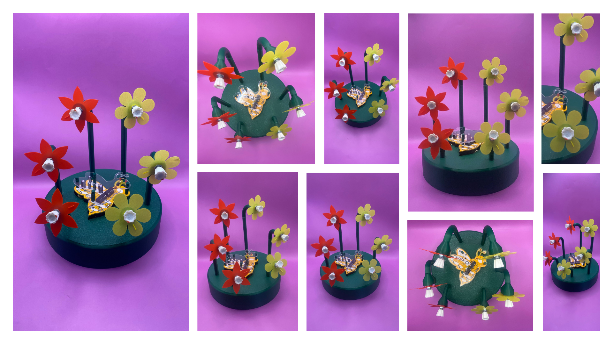

# examen-grupo-06

## Integrantes

- Catalina Catalán / [06-terroiblea](https://github.com/terroiblea/dis8644-2026-1-procesos-2/tree/main/06-terroiblea)
- Martina Echavarría / [10-martinaechavarria-stack](https://github.com/terroiblea/dis8644-2026-1-procesos-2/tree/main/10-martinaechavarria-stack)
- Nicolás Miranda / [18-Nicolas-Miranda1312](https://github.com/terroiblea/dis8644-2026-1-procesos-2/tree/main/18-Nicolas-Miranda1312)
- Vania paredes / [24-paredesvania](https://github.com/terroiblea/dis8644-2026-1-procesos-2/tree/main/24-paredesvania)
- Carla Pino / [25-coff4](https://github.com/terroiblea/dis8644-2026-1-procesos-2/tree/main/25-Coff4)

## Biofonía

> *"Lo que late, lo que zumba."*

### ¿Qué es Biofonía?

La biofonía es el conjunto de sonidos emitidos por los seres vivos en su hábitat natural. Estos sonidos son producidos tanto por grupos de animales como por individuos aislados, y en conjunto crean una sinfonía característica de cada lugar. Es un término clave en la ecología acústica (Paisajes Sonoros, s.f.).

Biofonía, el sintetizador, es una reinterpretación artificial de ese concepto, dos módulos que evocan procesos biológicos fundamentales. Uno late. El otro zumba. Ninguno está vivo, pero juntos construyen un paisaje sonoro que recuerda a un organismo. Suena a naturaleza, pero no lo es.

## Criterios de diseño del sistema

Biofonía nació como una coincidencia. Durante el desarrollo de los circuitos, nos dimos cuenta de que las dos placas que habíamos construido sonaban, sin haberlo planeado, como procesos vivos, una parecía el latido de un corazón y la otra el zumbido insistente de un insecto. Dejamos de ver dos circuitos independientes y empezamos a entenderlos como partes de un mismo organismo.

A partir de esa coincidencia surgió la pregunta que dio forma al proyecto: si un circuito puede latir y otro puede zumbar, ¿qué clase de ser habita entre ambos? La respuesta fue imaginar un ecosistema propio. Un jardín artificial donde cada módulo representa una escala distinta de la vida: Lub-dub representa la vida interna, el ritmo que mantiene vivo al organismo. Berry Benson representa la vida externa, el movimiento, la actividad, el entorno. Uno no existe sin el otro.

El concepto de biofonía apareció después, al intentar nombrar ese paisaje. En ecología acústica, la biofonía corresponde al conjunto de sonidos producidos por los seres vivos de un ecosistema. Nuestro instrumento no busca reproducir un ecosistema completo, sino capturar dos de sus gestos más reconocibles, el pulso interno del cuerpo y el movimiento constante del insecto. El interés está precisamente en esa distancia entre lo vivo y lo electrónico, donde un circuito puede recordar a un organismo sin dejar de evidenciar que es una máquina.

Esta lógica también definió las decisiones materiales y técnicas del proyecto. Biofonía fue posible gracias al acceso abierto a documentación e información en internet. En lugar de diseñar los circuitos desde cero, investigamos referentes existentes, analizamos sintetizadores DIY (hazlo tu mismo) y placas ya desarrolladas por la comunidad, comprendimos sus principios de funcionamiento y los adaptamos al proyecto. Esa disponibilidad de conocimiento permitió centrar el proceso en reinterpretar y combinar módulos ya probados para construir un sistema con identidad propia. La elección de componentes respondió además a la disponibilidad del contexto chileno, privilegiando piezas de fácil acceso en tiendas nacionales de electrónica, haciendo que el instrumento no solo sea reproducible, sino también reparable y replicable.

### Usuario

Biofonía es para quien escucha el mundo con atención. Para quien alguna vez se quedó despierto hasta las 3am porque había un mosquito volando en su oído o para quien no necesita que un sonido sea bonito para que le importe.

No tiene un perfil fijo. Puede venir de la música, del diseño, de la biología, o de ningún lugar en particular. Le atrae la idea de que un circuito pueda imitar algo vivo. Le atrae más todavía que no lo logre del todo, y que en esa distancia entre la naturaleza y la máquina viva algo interesante.

## Partes de Bíofonia 

### Placa 01:  Barry Benson (percutor)

Barry Benson no es una abeja. Es peor que una abeja, es una abeja con complejos, quiere ser una mosca. Tiene la capacidad sobreinsectoide de reproducir exactamente ese sonido de mosca agonizante atrapada entre tu oreja y la almohada a las 3 de la madrugada. Es la representación en silicio de ese sonido, Barry Benson pega zumbidos. Un zumbido ondulante que sube y baja de intensidad como si el insecto se acercara y alejara de tu oído a voluntad propia. La ciencia no puede explicar del todo por qué suena exactamente así. Nosotros tampoco. Pero lo hace.

#### ¿Qué hace Barry Benson por ti?

- Reproduce con fidelidad perturbadora el sonido de un insecto atrapado entre tu oreja y la almohada.
- Permite ajustar el zumbido con cuatro potenciómetros para encontrar el tono exacto que más molesta a tu compañero de pieza.
- Según investigaciones del prestigioso Instituto de Zumbidología Aplicada de Concepción, la exposición prenatal al sonido de Barry Benson produce niños con oído absoluto y una relación complicada con los insectos.
- Suena como bzzzZZZzzzbzzZZZZzbzz. Como si alguien hubiera atrapado una abeja en un sintetizador analógico y ninguno de los dos estuviera contento con la situación.

#### Funcionamiento

Barry Benson recibe 12V por un jack de alimentación, que el circuito reduce internamente a 5V usando un regulador L7805. Su único output es una señal de audio por un jack estéreo.

Cuando alguien usa Barry Benson, interactúa con cuatro potenciómetros. Cada uno controla la frecuencia de un oscilador independiente, en otras palabras, es básicamente qué tan rápido vibra cada "ala" de la abeja. El chip que hace posible todo esto es el CD40106BE, que contiene seis inversores Schmitt-trigger, componentes que deciden cuándo una señal es alta o baja, produciendo oscilaciones estables. Las cuatro señales resultantes se mezclan a través de compuertas XOR del chip CD4070. Una XOR produce señal sólo cuando sus entradas son distintas, así que al combinar frecuencias similares pero no idénticas, la salida fluctúa a una velocidad igual a la diferencia entre ambas. Ese fenómeno es lo que hace que el volumen suba y baje de forma orgánica y le da a Barry ese carácter de insecto vivo que ningún presente de sintetizador ha logrado replicar con tanta dignidad.

### Placa 02: Lub-dub (percutor)

Lub-dub hace exactamente lo que hace un corazón: bombea. Pero en vez de bombear sangre, bombea pulsos eléctricos. En vez de mantener vivo a un organismo, mantiene vivo el ritmo. Lub-dub late. A veces Tac. Tac. Tac. Otras, Dumb. Dumb. Dumb. Con la misma indiferencia biológica con que tu corazón te despertó esta mañana, Lub-dub bombea energía guiada por un compás. Es un percutor. Es un metrónomo pero con actitud.

#### ¿Qué hace Lub-dub por ti?

- Permite ajustar el tempo y el carácter del golpe, desde un latido tranquilo de persona en reposo hasta los 180bpm de alguien que acaba de ver su nota de taller.
- Es clínicamente superior a un metrónomo porque suena cool y los metrónomos no.
- Científicos del Instituto Cardiovascular de Sonidos Raros han determinado que escuchar Lub-dub mientras estudias mejora la concentración en un 340%. Este dato no ha sido verificado.
  
#### Funcionamiento

Lub-dub recibe 12V por un jack de alimentación, regulados internamente a 5V con un L7805. Su output es una señal de audio por un jack estéreo. Tiene cuatro potenciómetros que en conjunto controlan el tempo y el carácter del golpe.

El corazón del circuito es un oscilador construido con inversores Schmitt-trigger de los chips CD40106BE y CD4069UBE. Un condensador se carga y descarga continuamente a través de resistencias variables: los potenciómetros cambian esas resistencias, lo que cambia qué tan rápido se carga el condensador y por lo tanto qué tan rápido late y cómo suena ese latido. La ventaja del Schmitt-trigger es que conmuta en voltajes distintos al subir y al bajar, lo que produce ese golpe brusco y limpio en vez de una transición suave. Antes de llegar al output, la señal pasa por una red de condensadores y resistencias que recorta el pulso y lo convierte en un impulso corto y acentuado. Ese recorte es lo que transforma la oscilación en un tac o un dumb dependiendo de cómo estén ajustados los potenciómetros.

### Mixer

El Mixer es el jardinero silencioso de Biofonía. Su trabajo consiste en decidir quién tiene derecho a hablar y qué tan fuerte.

#### ¿Qué hace el Mixer por ti?

- Permite controlar el volumen de cada placa de forma completamente independiente.
- Puede silenciar cualquiera de los módulos sin necesidad de apagarlo, dejando que el resto del ecosistema continúe funcionando.
- Mezcla todas las señales en una única salida de audio lista para conectarse a un amplificador, una interfaz o cualquier equipo de sonido.

#### Funcionamiento

El Mixer recibe las señales de audio provenientes de cada una de las placas de Biofonía. Cada entrada pasa primero por un potenciómetro, que actúa como un control de volumen independiente, al girarlo se atenúa o aumenta el nivel de esa señal, llegando incluso a dejarla completamente en silencio.

Una vez ajustados los niveles, las señales se combinan en un circuito mezclador de dos canales, obteniendo una única salida de audio. Esa salida es la que finalmente abandona Biofonía a través del jack de audio para ser amplificada.

El Mixer utilizado en Biofonía corresponde al diseño Two Channel Mini Mixer, publicado por DIY Strat. Se utilizó como base para la mezcla de las señales de audio provenientes de las distintas placas, adaptándolo a las necesidades del proyecto (cambiar potenciometros y resistencias). 

### Esquemático Bíofonia

### BOM

| Componente                         | Cantidad  | Valor unitario  | Link compra                                                                                                                                 |
|------------------------------------|-----------|-----------------|---------------------------------------------------------------------------------------------------------------------------------------------|
| Placa Barry Benson                 | 1         | $2.154          | <https://jlcpcb.com/>                                                                                                                                           |
| Placa Lub-dub                      | 1         | $2.182          | <https://jlcpcb.com/>                                                                                                                                           |
| Chip 4069UBE                       | 1         | $1.100          | <https://www.cabezacuadrada.cl/product/cd4069/>                                                                                             |
| Chip CD40106BE                     | 2         | $750            | <https://www.cabezacuadrada.cl/product/cd40106be/>                                                                                          |
| Chip CD4070BE                      | 1         | $2.080          | <https://www.maspotencia.cl/circuito-integrado-cd4070be-14-pines>                                                                           |
| Potenciometro 100K                 | 6         | $490            | <https://www.mechatronicstore.cl/potenciometro-rotacional-10k/>                                                                             |
| Potenciometro 250K                 | 4         | $495            | <https://altronics.cl/potenciometro-lineal-250k-b250k\>                                                                                     |
| Capacitor no polarizado 10nf       | 1         | $100            | <https://www.mechatronicstore.cl/condensadores-ceramicos-distintos-valores/>                                                                |
| Capacitor no polarizado 100nF      | 5         | $100            | <https://www.mechatronicstore.cl/condensadores-ceramicos-distintos-valores/>                                                                |
| Capacitor polarizado 0.22uF 50V    | 1         | $100            | <https://www.mechatronicstore.cl/condensador-capacitorio-de-electrolitico-por-unidad-varios-valores/>                                       |
| Capacitor polarizado 1uF 50V       | 1         | $100            | <https://www.mechatronicstore.cl/condensador-capacitorio-de-electrolitico-por-unidad-varios-valores/>                                       |
| Capacitor polarizado 10uF 50V      | 5         | $100            | <https://www.mechatronicstore.cl/condensador-capacitorio-de-electrolitico-por-unidad-varios-valores/>                                       |
| Capacitor polarizado 100uF 50V     | 3         | $100            | <https://www.mechatronicstore.cl/condensador-capacitorio-de-electrolitico-por-unidad-varios-valores/>                                       |
| Resistencia 1K                     | 3         | $100            | <https://www.mechatronicstore.cl/resistencias-electricas-3w-por-unidad/>                                                                    |
| Resistencia 10K                    | 2         | $100            | <https://triacs.cl/accesorios/1138-resistencia-10k-ohm-12w-5-unid-.html>                                                                    |
| Resistencia 100K                   | 2         | $100            | <https://www.mechatronicstore.cl/resistencias-electricas-1-2-w-1-unidad/>                                                                   |
| Led 3mm/5mm                        | 3         | $100            | <https://www.mechatronicstore.cl/led-3mm-5mm/>                                                                                              |
| Diodo 1N4007                       | 2         | $200            | <https://www.mechatronicstore.cl/diodo-rectificador-in4007-1n4007-4007/>                                                                    |
|Tabla Circuito Impreso | 1 | $1.500 | <https://www.mercadolibre.cl/tabla-circuito-impreso-doble-soldadura-3x7-cm-pcb/p/MLC67595157> | 
| Regulador de Voltaje L7805         | 2         | $490            | <https://www.mechatronicstore.cl/regulador-limitador-de-voltaje-5v-dc/>                                                                     |
| Barrel Jack Switch                 | 4         | $100            | <https://fu-chengele.en.made-in-china.com/product/UjYJGqdbAyWi/China-5-5-mm-X-2-1mm-DC-Power-Jack-Socket-Female-Panel-Mount-Connector.html> |
| Audio Jack                         | 3         | $60             | <https://niekonaujo.lt/Conector-Audio-Hembra-3-5mm-3-Pines-PJ-301M-Tipo-DIP-Para/1102473>                                                   |
| Cable                              | 5 metros  | $399 (x metro)  | <https://www.mercadolibre.cl/cable-de-parlante-2x16-100-mt/up/MLCU59517873>                                                                 |
| Bateria 9v                         | 1         | $7.990          | <https://www.sodimac.cl/sodimac-cl/articulo/110251085/bateria-recargable-9v/110251089>                                                      |
| Adaptador Conector Jack - Batería  | 1         | $1.486          | <https://www.mercadolibre.cl/adaptador-conector-jack-bateria-9v-para-arduino-uno-y-mega/up/MLCU13157421>                                    |
| Cautin                             | 1         | $9.990          | <https://www.sodimac.cl/sodimac-cl/articulo/135572071/cautin-tipo-lapiz-15-w/135572072>                                                     |
| Soldadura Estaño                   | 1         | $2.150          | <https://www.sodimac.cl/sodimac-cl/articulo/110271916/soldadura-lapiz-estano-plomo-60-40-17-gr-para-electronica/110271921>                  |
| Pasta de soldar                    | 1         | $1.490          | <https://www.sodimac.cl/sodimac-cl/articulo/110252609/pasta-para-soldar-50-gr/110252612>       |

### Consideraciones

El valor unitario de cada placa fue estimado considerando una compra masiva, ya que las PCBs tienen un costo de fabricación bajo, pero el envío a Chile es relativamente caro. Al distribuir ese costo entre varias unidades, el precio por placa disminuye considerablemente.       

Construir un **Biofonía** sin considerar la carcasa tiene un costo total de **$41.109 CLP**. Si se descuentan las herramientas e insumos reutilizables adquiridos para el proceso (como cautín, estaño, etc.), el costo efectivo de los componentes necesarios para fabricar una unidad es de **$27.479 CLP**.

En teoría, el tiempo de ensamblaje y soldadura de todas las placas es de aproximadamente **2 horas entre dos personas**. Esto, por supuesto, asumiendo un universo paralelo donde todas las soldaduras quedan bien al primer intento, ningún componente viene defectuoso, ningún integrado se instala al revés y jamás se rompe una pista del PCB.

En el universo que nos tocó habitar, el proceso completo de soldadura, diagnóstico, desoldado, reparación, pruebas y vuelta a empezar tomó cerca de **90 horas de trabajo**. Porque hacer electrónica consiste, aproximadamente, en un 10% de soldar y un 90% de preguntarse por qué dejó de funcionar algo que hace cinco minutos sí funcionaba. 

## Aprendizajes y errores

### El caso del Chirihue

La idea original de Biofonía contemplaba tres organismos: una abeja, un corazón y un pájaro. La tercera placa correspondía al **Chirihue Mecanizado**, un sintetizador que imitaba el canto de un chirihue y que completaba el ecosistema que queríamos construir.

Desde el punto de vista conceptual, la inclusión tenía mucho sentido. Cada placa representaba un ser vivo distinto y, juntas, daban forma a un pequeño paisaje sonoro inspirado en la naturaleza.

Sin embargo, el Chirihue nunca logró funcionar como esperábamos. Se intentó solucionar revisando soldaduras, probándolo en protoboard y realizando distintas modificaciones, pero el sonido dependía de un amplificador y un altavoz externos que complicaban la integración con las otras dos placas. Continuar intentando resolver ese circuito significaba retrasar el desarrollo de la carcasa y del sintetizador completo.

Finalmente, se tomó la decisión de eliminar esta placa del proyecto y concentrar los esfuerzos en Barry Benson y Lub-dub. Aunque al principio pareció una pérdida, terminó convirtiéndose en una decisión de diseño importante. Biofonía pasó de ser un sistema de tres módulos a uno de dos, simplificando su construcción y permitiendo desarrollar una propuesta más sólida dentro del tiempo disponible.

### Aprendizajes

- Diseñar también implica saber renunciar a una idea cuando mantenerla compromete el desarrollo del proyecto completo.
- Los chips pueden venir defectuosos o quemarse durante el proceso, por lo que siempre es recomendable probar con otro antes de asumir que el circuito completo está fallando.
- Los cables pueden romperse internamente aunque externamente parezcan estar en buen estado. Comprobar continuidad ahorra mucho tiempo de diagnóstico.
- Revisar siempre la orientación de los circuitos integrados antes de soldarlos.
- Antes de diagnosticar una falla compleja, comprobar que la batería esté cargada y que el parlante funcione correctamente.
- Mantener un orden en las conexiones facilita enormemente la búsqueda de errores.

### Errores

- La placa **Lub-dub** tuvo que soldarse completamente en tres ocasiones antes de conseguir un resultado funcional.
- Una de las placas del corazón terminó inutilizable debido al exceso de soldaduras y desoldaduras, dañándose parte de las pistas del PCB.
- Durante una reparación, la placa **Barry Benson** perdió una pista de cobre al desoldar un componente, por lo que fue necesario soldar todo con mucho cuidado de la otra parte.
- Algunos chips fueron instalados al revés o se colocaron componentes incorrectos, obligando a desmontar parte del circuito.
- En varias ocasiones el problema resultó ser simplemente una batería descargada o un parlante con poca carga.
- Los cables utilizados se cortaban con facilidad, obligando a repetir soldaduras prácticamente durante todo el proceso de ensamblaje.
- Para comprobar el funcionamiento era necesario soldar completamente las placas, pero luego había que desmontar parte del cableado para integrarlas a la carcasa, aumentando el riesgo de generar nuevas fallas.
- La mayoría de nuestros errores finales consistieron en una falla en la soldadura de muchos potenciómetros, aunque no lo parezca soldar bien un potenciómetro es difícil.

### Registro proceso

### Video proceso placa corazón

## Carcasa

El objetivo desde el principio fue que Biofonía no pareciera un sintetizador. Que alguien lo viera sobre una mesa y no supiera inmediatamente qué es, pero que quisiera tocarlo igual.
El principal referente para el desarrollo de la carcasa fue el trabajo de **Kelly Heaton**, cuya práctica transforma circuitos electrónicos en organismos que parecen pertenecer al mundo natural. En particular, *Circuit Garden* y *Electronic Naturalism* sirvieron como guía para pensar la electrónica no como algo que debe ocultarse o disfrazarse, sino como una forma de vida propia. Más que replicar su estética, nos interesó su manera de construir un ecosistema donde tecnología y naturaleza dejan de ser opuestos y comienzan a convivir, una idea que terminó definiendo el jardín donde habita Biofonía. 

Siguiendo la lógica del sistema, si los módulos imitan seres vivos y el conjunto forma un ecosistema, la carcasa tenía que ser el lugar donde ese ecosistema existe. La respuesta fue un jardín: una base verde de la que emergen flores, y en cada flor vive una perilla. Las criaturas no flotan en el aire, habitan algo.
En base a esta explicación surgió la idea 01 que juntaba el uso de las 3 placas anteriormente usada: 

Sin embargo, como el diseño evolucionó durante el desarrollo del proyecto la placa del Chirihue Mecanizado dejó de formar parte del sistema, por lo que fue necesario replantear la distribución original de la carcasa. Esta modificación permitió simplificar el conjunto y reforzar la relación entre los dos módulos restantes (el corazón y la abeja), por lo que se tomó la decisión de dejar la placa de Barry Benson visible sobre la superficie. A diferencia del corazón, que permanece integrado bajo las flores del jardín, la abeja aparece expuesta como parte del paisaje, enfatizando su carácter de organismo que habita y recorre el entorno. De este modo, la electrónica deja de ocultarse y pasa a formar parte de la estética del objeto, en línea con los referentes del proyecto.

Para que todo correspondiera con precisión a las medidas reales de los componentes, potenciómetros, jacks y switches, se decidió utilizar impresión 3D. Es el método que mejor permite iterar rápido, ajustar medidas y garantizar que cada pieza encaje donde tiene que encajar.

La impresión 3D también hizo posible una decisión conceptual importante. El corazón no debía estar expuesto. Como ocurre en un organismo vivo, Lub-dub permanece resguardado dentro del cuerpo del instrumento. Solo al levantar Biofonía puede verse a través de una base de acrílico transparente, revelando aquello que normalmente permanece oculto. En contraste, Barry Benson habita la superficie del jardín, donde puede verse e interactuar con el entorno. Ambos ocupan el lugar que les corresponde: uno protegido en el interior, el otro recorriendo el exterior.  

### Aprendizajes y errores de la carcasa

La fabricación de la carcasa fue un proceso tan iterativo como el desarrollo electrónico. Aunque el concepto del jardín se mantuvo desde el comienzo, la forma final fue el resultado de múltiples pruebas de impresión y ajustes de medidas hasta conseguir que todas las piezas encajaran correctamente.

#### Aprendizajes

- La impresión 3D permitió iterar rápidamente hasta encontrar las dimensiones correctas para cada pieza.
- Diseñar considerando las tolerancias de impresión facilitó el montaje final de potenciómetros, jacks y placas.
- Prototipar antes de imprimir todas las piezas permitió detectar problemas de tamaño y ahorrar tiempo en las siguientes iteraciones.

#### Errores

- Las primeras flores impresas resultaron demasiado delgadas y frágiles, por lo que fue necesario aumentar sus espesores e imprimirlas nuevamente.
- Fue necesario modificar varias veces el tamaño de las flores y de sus piezas interiores hasta lograr que todas calzaran correctamente.
- Como inicialmente el proyecto contemplaba tres placas, se imprimieron numerosas piezas que finalmente no fueron utilizadas cuando se eliminó el Chirihue Mecanizado del sistema.

### Resultado carcasa 

### Video proceso sonido placa + parte de la carcasa 

---

## Partitura 1

Esta no tiene pentagramas, no tiene corcheas, no tiene nada que te haga sentir mal por no saber solfeo. Es una partitura para dos criaturas electrónicas que nunca han tomado clases de música y están muy bien así.

La obra dura 24 horas y está pensada para ser tocada una vez al día, todos los días. Su lógica es biológica: Barry Benson es estrictamente diurna, sale al amanecer y vuelve a la colmena al anochecer. Lub-dub nunca para, pero su ritmo cambia según lo que ocurre afuera. Uno marca el tiempo del mundo exterior. El otro responde.

### Cómo leer la partitura:

Cada potenciómetro tiene una flor con 6 pétalos. El pétalo marcado con una línea es el pétalo 1 y corresponde al mínimo. Desde ahí se gira la perilla.. El pétalo 6 es el máximo. Cada módulo tiene tres flores:

- **Flor alta** — controla la velocidad.
- **Flor media** — controla el carácter del sonido.
- **Flor pequeña** — controla el volumen.

Barry Benson: Flores amarillas
Lub-dub: Flores Rojas

#### 08:00 – 12:00

| Módulo |  Velocidad |  Carácter | Volumen |
|--------|-------------|------------|-----------|
| Barry Benson | pétalo 3 | pétalo 3 | pétalo 3 |
| Lub-dub | pétalo 5 | pétalo 4 | pétalo 3 |

#### 12:01 – 16:00

| Módulo |  Velocidad | Carácter | Volumen |
|--------|-------------|------------|-----------|
| Barry Benson | pétalo 4 | pétalo 5 | pétalo 5 |
| Lub-dub | pétalo 5 | pétalo 5 | pétalo 6 |

#### 16:01 – 20:00

| Módulo | Velocidad |  Carácter | Volumen |
|--------|-------------|------------|-----------|
| Barry Benson | pétalo 2 | pétalo 4 | pétalo 4 |
|  Lub-dub | pétalo 4 | pétalo 3 | pétalo 6 |

#### 20:01 – 07:59

| Módulo | Velocidad | Carácter | Volumen |
|--------|-------------|------------|-----------|
|  Barry Benson | pétalo 1 | pétalo 1 | pétalo 1 |
| Lub-dub | pétalo 3 | pétalo 2 | pétalo 6 |

#### Notas de interpretación

- Las transiciones entre actos no son abruptas. Las flores se giran despacio, como quien no quiere que nadie se dé cuenta de que algo cambió.
- Los pétalos son un punto de partida, no una ley. Si al girar una flor suena horrible, gírala hasta que suene bien y anótalo. La partitura es un ser vivo.

### Referentes partitura 1 

La primera partitura toma como referencia dos obras fundamentales del arte conceptual y la música experimental: **Pomelo** (1964) de **Yoko Ono** y **Pendulum Music** (1968) de **Steve Reich**.

Por una parte, *Grapefruit* reúne una serie de instrucciones poéticas que invitan al lector a imaginar o realizar acciones, entendiendo la obra como un conjunto de posibilidades más que como un objeto terminado. Por otra parte, *Pendulum Music* propone una composición cuya partitura consiste principalmente en instrucciones para montar una situación sonora. En lugar de controlar cada detalle del resultado musical, Steve Reich define las condiciones iniciales y permite que fenómenos físicos, como el movimiento pendular y la retroalimentación del sonido, construyan la obra. 

En ambos referentes, la partitura deja de ser un sistema para representar música y pasa a convertirse en una guía para generar una experiencia sonora. Esa misma idea fue la que orientó el diseño de la primera composición de Biofonía. 

## Partitura 2

### Referentes partitura 2 

Para el desarrollo de las partituras 02 de Biofonía se tomaron como referencia distintos ejemplos de *notación o partituras gráfica*, entendiendo la partitura como una representación visual del sonido más que como un sistema tradicional basado en pentagramas. En particular, las partituras de **Anestis Logothetis** inspiraron el uso de líneas, gestos y formas libres para representar cualidades sonoras, mientras que **Artikulation (1970)**, la partitura de escucha desarrollada por **Rainer Wehinger** para la obra homónima de György Ligeti, sirvió como referente por su manera de traducir sonidos electrónicos en un lenguaje visual mediante colores, recorridos y símbolos. Ambos ejemplos demuestran que la música puede comunicarse a través de recursos gráficos, permitiendo que la imagen exprese ritmo, intensidad y comportamiento del sonido sin depender de la notación musical convencional.

### Desarrollo partitura 2

Antes de comenzar a dibujar la partitura, fue necesario definir un lenguaje visual para cada uno de los módulos del sintetizador. La idea era que cada placa pudiera identificarse no solo por el sonido que produce, sino también por una representación gráfica propia.

- **Barry Benson**, representado en color amarillo (🟡), utiliza las líneas curvas e irregulares que comúnmente se emplean para ilustrar de forma caricaturesca el recorrido de una abeja en vuelo.
- **Lub-dub**, representado en color rojo (🔴), utiliza como referencia el trazado de un electrocardiograma, evocando visualmente el pulso y los latidos del corazón.

Una vez definido este lenguaje gráfico, la partitura fue desarrollada digitalmente en **Procreate**. Para facilitar su lectura e interpretación, se estableció una estructura basada en dos ejes:

- El eje vertical (lado izquierdo) representa el **la perilla**, dividida en cinco niveles. La línea central corresponde al medio, mientras que los extremos representan el mínimo (0) y el máximo (100).
- El eje horizontal representa el **tiempo**. La partitura se divide en cinco secciones iguales, donde cada división corresponde a un minuto de interpretación.

## Bibliografía

- DIY Strat. (2008, 17 de agosto). *Two-channel mini-mixer*. Guitar and Effects DIY. <https://diystrat.blogspot.com/2008/08/two-channel-mini-mixer.html>
- Heaton, K. (s.f.). *Kelly Heaton Studio*. <https://www.kellyheatonstudio.com/>
- Inti-Illimani. (s.f.). *La Fiesta de San Benito*. Letras.com. <https://www.letras.com/inti-illimani/516597/>
- Logothetis, A. (s.f.). *The Graphic Notation*. <http://anestislogothetis.musicportal.gr/the_graphic_notation/>
- Modern Met. (2021, 22 de abril). *Esta artista crea "aves electrónicas" impresas en 3D que cantan como pájaros reales*. My Modern Met en Español. <https://mymodernmet.com/es/kelly-heaton-aves-circuitos/>
- Pearson, K. (2024). *Make: Electronic Music from Scratch*. Make Community, LLC.
- The Hum Blog. (2016, 5 de abril). *György Ligeti's Artikulation (with score and audio)*. <https://blogthehum.com/2016/04/05/gyorgy-ligetis-artikulation-with-score-and-audio/>
- Williams, E. (2015, 25 de marzo). *Logic Noise: Filters and Drums*. Hackaday. <https://hackaday.com/2015/03/25/logic-noise-filters-and-drums/>
